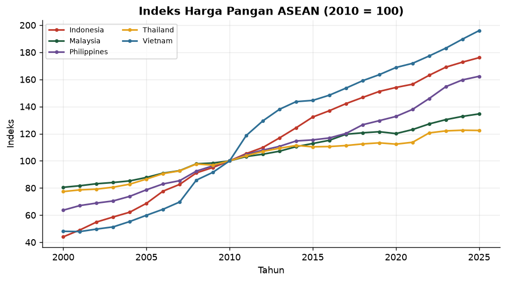
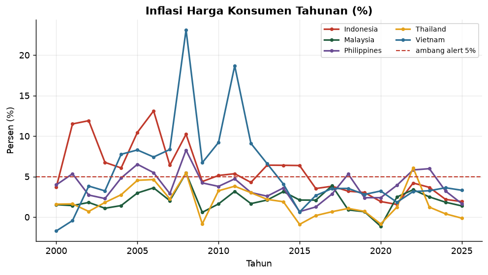
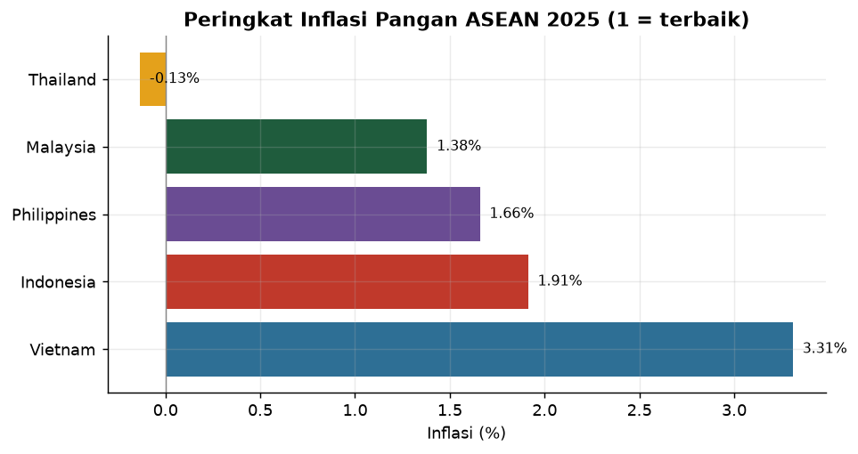
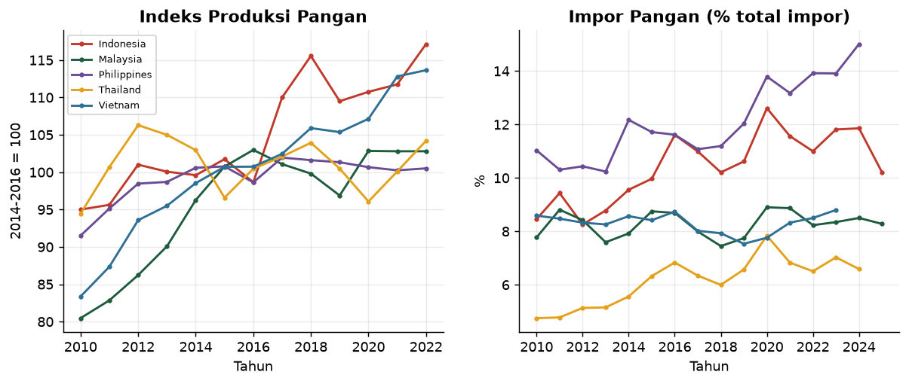
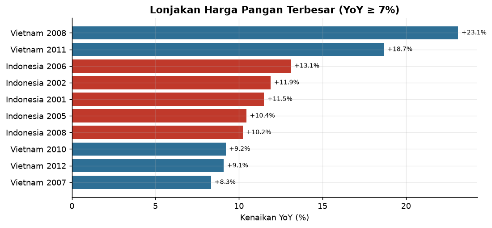
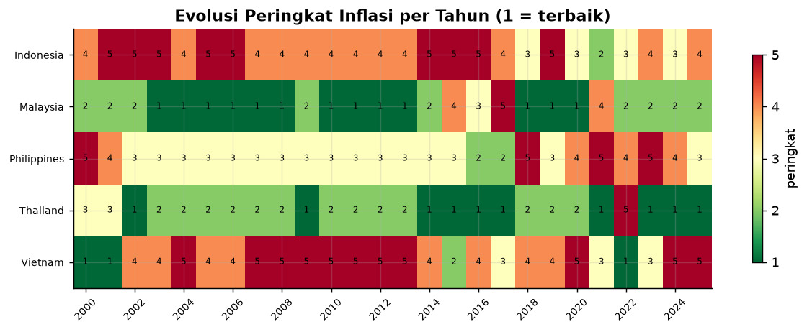

<div align="center">


### 🔗 [**Buka Dashboard Live →**](https://food-price-intelligence.streamlit.app)

</div>

---

## 🌾 Apa ini?

**Data platform end-to-end** (bukan notebook) untuk memantau **harga & ketahanan
pangan ASEAN**: pipeline otomatis dari API publik → database → SQL marts →
dashboard + alert.

Fokus project ini **bukan** visualisasi saja, melainkan **rekayasa data**:
lapisan ingest/transform/test yang dapat direproduksi, diaudit, dan dijalankan
ulang oleh siapa pun tanpa kredensial.

```bash
python src/run_pipeline.py     # ingest → load → transform → tests → alerts
streamlit run app/dashboard.py # dashboard interaktif
```

---

## 🏗️ Arsitektur

```
 World Bank API ─┐
                 ├─► ingest.py ─────► data/staging (Parquet, long format)
 Frankfurter ────┤
 BPS WebAPI ─────┘   ingest_bps.py ─► inflasi & harga bulanan per kota
                                          │
                                          ▼
                                 load_db.py ─► DuckDB (staging tables)
                                          │
                                          ▼
                        sql/transform.sql ─► marts (DuckDB + Parquet)
                                          │
                    ┌─────────────────────┼──────────────────────┐
                    ▼                     ▼                      ▼
             dashboard.py            alerts.py        tests/test_data_quality.py
```

| Lapisan | File | Peran |
|---|---|---|
| **Ingest WB** | `src/ingest.py` | Tarik World Bank + kurs → Parquet (idempoten) |
| **Ingest BPS** | `src/ingest_bps.py` | Inflasi pangan & harga beras bulanan per kota |
| **Load** | `src/load_db.py`, `sql/schema.sql` | Muat ke DuckDB |
| **Transform** | `sql/transform.sql`, `src/transform.py` | SQL murni: YoY, flag, pivot, ranking |
| **Quality** | `tests/test_data_quality.py` | 20 uji: unik, lengkap, rentang, konsistensi, kesegaran |
| **Alert** | `src/alerts.py` | Deteksi inflasi tinggi, lonjakan harga, akselerasi |
| **Narasi** | `src/explanations.py` | Kenapa · Tujuan · Dampak untuk 15 elemen |
| **Serve** | `app/dashboard.py` | Dashboard Streamlit (+ expander penjelasan) |
| **Chart** | `src/make_charts.py` | PNG statis untuk README |
| **Orchestrate** | `src/run_pipeline.py` | Jalankan seluruh pipeline |

---

## 📊 Data & Cakupan

| Aspek | Nilai |
|---|---|
| Sumber indikator | **World Bank Open Data** (tahunan) + **BPS WebAPI** (bulanan per kota) |
| Negara | Indonesia, Malaysia, Thailand, Vietnam, Philippines (ASEAN) |
| **Inflasi pangan per kota** | **18.384 baris · 91 kota · bulanan · 2020–2023** |
| **Inflasi bulanan per kota** | **9.564 baris · 151 kota · s/d 2026** ⭐ |
| **Harga beras grosir** | **86 baris · bulanan · 2020–2026** ⭐ |
| Harga beras eceran (historis) | 145 baris · 33 kota · 2000–2016 |
| Rentang World Bank | 2000–2025 (26 tahun) |
| Uji kualitas | **20/20 lulus** |

---

## 🔍 Temuan (dari pipeline ini)

1. **Harga beras grosir naik konsisten** Rp12.261 (2020) → **Rp14.901/kg (Agu 2026)**.
2. **Indonesia inflasi pangan 1.91% (2025)** — turun dari puncak 4.21% (2022).
3. **Kantong inflasi bulanan 2026** terkonsentrasi di Indonesia timur: Luwuk,
   Kolaka, Tual, Bau-Bau, Ternate — sulit dijangkau, biaya logistik tinggi.
4. **Gejolak musiman**: Januari & Desember inflasi pangan tertinggi (hari besar);
   Agustus deflasi (panen). Terlihat jelas di data bulanan BPS.
5. **Krisis pangan 2008 terdeteksi otomatis**: Vietnam +23.1%, Indonesia +10.2%.

---

## 📊 Visualisasi

Setiap elemen disertai narasi **Kenapa · Tujuan · Dampak** — angka tanpa makna
adalah kebisingan. Narasi lengkap ada di `src/explanations.py` (dapat diaudit)
dan tampil sebagai expander di dashboard.

### 1. Indeks Harga Pangan (2010 = 100)



> **Kenapa** — inflasi tahunan naik-turun; indeks memberi garis dasar kumulatif.
> **Tujuan** — membandingkan tingkat harga antar negara pada skala sama.
> **Dampak** — indeks jauh di atas 100 = biaya hidup tertekan berkepanjangan.

### 2. Inflasi Harga Konsumen Tahunan (%)



> **Kenapa** — inflasi adalah sinyal paling langsung tekanan harga (ambang 5%).
> **Tujuan** — menemukan tahun lonjakan (krisis) & kemampuan menjinakkannya.
> **Dampak** — pola naik bersama = guncangan global (2008, 2022) butuh respons terkoordinasi.

### 3. Peringkat Inflasi Pangan ASEAN



> **Kenapa** — angka absolut sulit dimaknai tanpa pembanding regional.
> **Tujuan** — posisi tiap negara & siapa paling berhasil menahan harga.
> **Dampak** — peringkat rendah = tekanan publik; peringkat atas = praktik yang bisa dipelajari.

### 4. Ketahanan Pangan: Produksi & Impor



> **Kenapa** — harga ditentukan pasokan & permintaan, domestik vs luar.
> **Tujuan** — menilai apakah kemandirian pangan menguat atau melemah.
> **Dampak** — produksi stagnan + impor tinggi = kerentanan terhadap guncangan global & kurs.

### 5. Lonjakan Harga Historis (Anomali)



> **Kenapa** — preseden lonjakan menunjukkan kerentanan struktural yang bisa terulang.
> **Tujuan** — mengidentifikasi pola historis (mis. krisis 2008) untuk kesiapsiagaan.
> **Dampak** — jika berulang dengan pemicu sama, kebijakan diarahkan ke akar masalah.

### 6. Evolusi Peringkat per Tahun



> **Kenapa** — satu potret tahun menyesatkan; tren lebih penting.
> **Tujuan** — siapa yang konsisten kuat vs naik-turun, dan kapan keluar jalur.
> **Dampak** — perbaikan stabil = kebijakan berhasil; peringkat berbalik tajam = sinyal krisis/reformasi.

---

## ⚠️ Keterbatasan yang diakui terbuka

- **Harga mikro harian** (Bapanas/PIHPS) masih terkunci (endpoint 401).
  Digantikan data **BPS bulanan per kota** — granular & resmi, tetapi bukan harian.
- **Harga beras grosir** (BPS) adalah tingkat perdagangan besar, bukan eceran.
- **Inflasi = kelompok makanan** (termasuk minuman & tembakau), bukan pangan murni.
- **Lag publikasi**: World Bank tertinggal 1–2 tahun; BPS lebih cepat (s/d 2026).
- **5 negara ASEAN** untuk perbandingan lintas negara (ketersediaan seragam).
- Ambang alert **deterministik** (bukan ML) — dijelaskan di ADR-005.

> `BPS_API_KEY` disimpan di `.env` (tidak di-commit). Data Cloud tetap dapat
> menyajikan hasil karena marts di-commit; `--no-ingest` untuk jalan tanpa key.

---

## 🧪 Kualitas data (contoh)

```
PASS  stg_wb PK unik
PASS  YoY konsisten dgn rumus
PASS  flag spike konsisten
PASS  ranking referensial ke security
PASS  data segar (<= 2 tahun)
...
[dq] 16 lulus, 0 gagal → [dq] SEMUA UJI LULUS
```

Uji berjalan sebagai **gerbang wajib** di akhir pipeline.

---

## 📁 Struktur

```
food-price-intelligence/
├── src/
│   ├── config.py            # path, sumber, ambang alert, warna
│   ├── ingest.py            # World Bank + kurs → staging
│   ├── load_db.py           # staging → DuckDB
│   ├── transform.py         # SQL marts → Parquet
│   ├── alerts.py            # deteksi lonjakan
│   ├── explanations.py      # narasi Kenapa·Tujuan·Dampak (13 elemen)
│   ├── make_charts.py       # PNG untuk README (6 chart)
│   └── run_pipeline.py      # orkestrator end-to-end
├── sql/
│   ├── schema.sql           # skema staging + marts
│   └── transform.sql        # logika analitik (SQL murni)
├── tests/
│   └── test_data_quality.py # 16 uji kualitas data
├── app/dashboard.py         # Streamlit (+ expander Kenapa·Tujuan·Dampak)
├── docs/
│   ├── ADR.md               # keputusan arsitektur (jujur)
│   └── ERD.md               # relasi & lineage
├── data/{raw,staging,marts}/
├── db/                      # food.duckdb
└── reports/
    ├── alerts.json · alerts.md
    └── figures/             # 6 chart PNG untuk README
```

---

## 🚀 Quick Start

```bash
pip install -r requirements.txt
cp .env.example .env          # isi BPS_API_KEY (daftar di webapi.bps.go.id)
python src/run_pipeline.py          # pipeline penuh
python src/make_charts.py           # chart PNG untuk README
streamlit run app/dashboard.py      # buka http://localhost:8501
```

Tanpa ingest ulang (pakai staging yang ada):
```bash
python src/run_pipeline.py --no-ingest
```

---

## 📖 Cara Membaca Dashboard (Kenapa · Tujuan · Dampak)

Setiap metrik, chart, dan tabel punya kotak penjelasan yang menjawab:

| Pertanyaan | Arti |
|-----------|------|
| **🔎 Kenapa** | Mengapa metrik ini dipilih (masalah & konteks) |
| **🎯 Tujuan** | Pertanyaan bisnis/kebijakan yang dijawab |
| **📈 Dampak** | Implikasi & keputusan yang bisa timbul |
| **👁️ Cara baca** | Panduan bila grafik tak intuitif |

Narasi tersimpan di `src/explanations.py` (13 elemen, dapat diaudit):
```bash
python src/explanations.py     # → Penjelasan: 13 | SEMUA LENGKAP
```

> Prinsip: dashboard tanpa narasi adalah angka tanpa makna. Klien tidak membeli
> SQL — mereka membeli kemampuan menjelaskan apa artinya.

---

## 🛠️ Tech Stack

| Layer | Teknologi |
|---|---|
| **Sumber** | World Bank Open Data API · Frankfurter (ECB rates) |
| **Ingest** | Python stdlib `urllib` + pandas + pyarrow |
| **Database** | **DuckDB** (embedded OLAP, SQL penuh) |
| **Transform** | SQL murni (CTE, window functions) |
| **Quality** | Uji kustom berbasis DuckDB (CI-friendly) |
| **Dashboard** | Streamlit + Plotly |
| **Orkestrasi** | `run_pipeline.py` (subprocess, exit-code gating) |

---

## 👤 Author

<div align="center">

**Sandi Ridwan** — Data Analyst · Data Automation Engineer · Python

📍 Palu, Central Sulawesi, Indonesia

[](https://www.upwork.com/freelancers/~011f6d0fbb4a372974)
[](https://linkedin.com/in/sandi-ridwan)
[](https://github.com/SandiRidwan)

</div>

## 📄 License

MIT — Educational & portfolio. Data © World Bank (CC BY 4.0).
